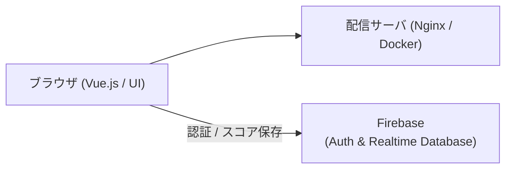

# BaseballGame

ブラウザ上で手軽に遊べる野球シミュレーション／アクションゲームです。  
打撃・投球などの操作判定や試合進行、Firebaseと連携したスコア保存・ランキング機能を提供します。

---

## 主な機能

- **試合プレイ**: ブラウザ上での直感的なバッティング・ピッチング操作と試合進行。
- **データ連携**: Firebase Authentication によるユーザー認証と、Firebase Realtime Database を活用したハイスコア記録・ランキング表示。
- **マルチデバイス対応**: レスポンシブな画面設計。

---

## システム構成



- **フロントエンド**: Vue.js, Webpack, Gulp, Dart Sass
- **バックエンド/インフラ**: Firebase (Auth / Database), Nginx, Docker Compose

---

## 開発環境のセットアップ

### 1. 依存パッケージのインストール

```bash
cd application
yarn install
```

### 2. ローカル開発サーバの起動

```bash
# Webpack Dev Server を起動（ホットリロード対応）
yarn dev-server
```

ブラウザで `http://localhost:4000` を開きます。

### 3. Docker Compose による配信確認

```bash
# プロジェクトルートで実行
docker compose up -d
```

---

## ビルドとテスト

```bash
cd application

# 開発用ビルド・ファイル監視
yarn gulp

# 本番用ビルド（静的解析・バンドル・スタイル生成）
yarn gulp:build

# 単体テストの実行
yarn test
```

---

## ディレクトリ構成

```text
BaseballGame/
├── application/             # ゲームクライアントのソースコード
│   ├── src/                 # Vueコンポーネント、ゲーム進行ロジック、Firebase連携
│   ├── tests/               # 境界値・判定・外部連携のテストスイート
│   └── package.json
├── web/                     # Nginx の配信設定
└── docker-compose.yaml      # コンテナ実行定義
```